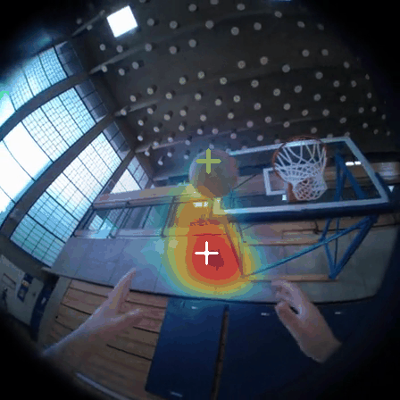
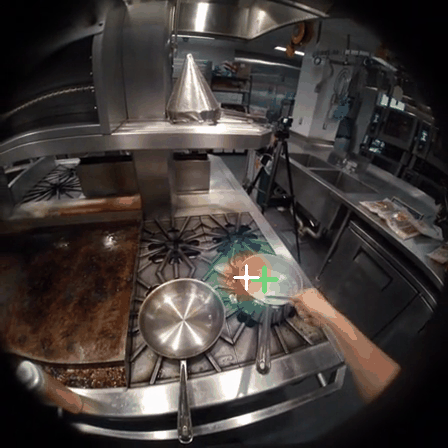
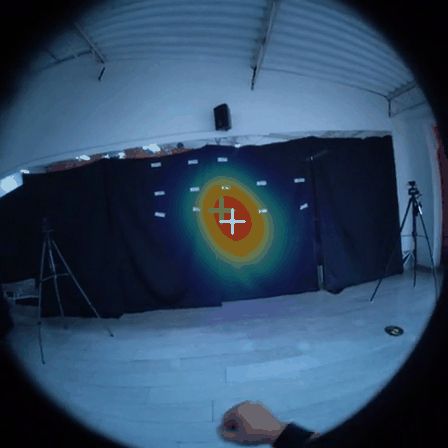
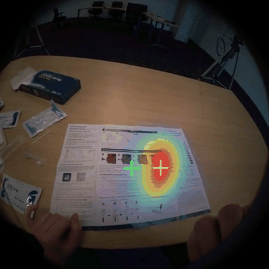
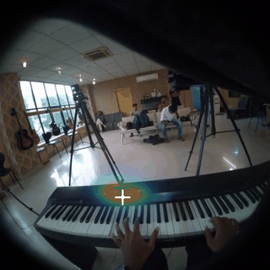
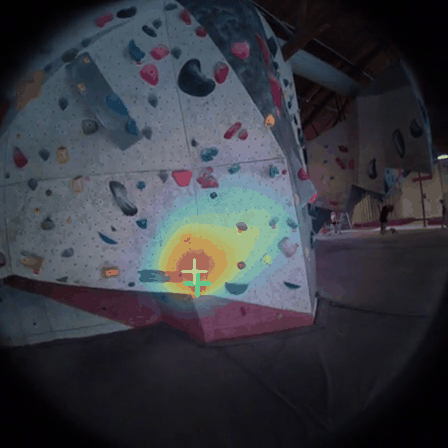
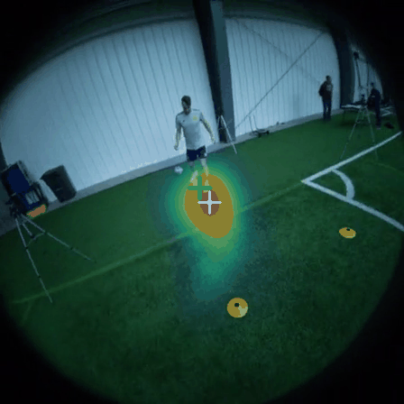
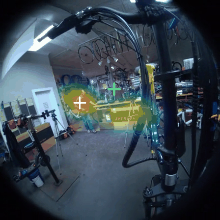
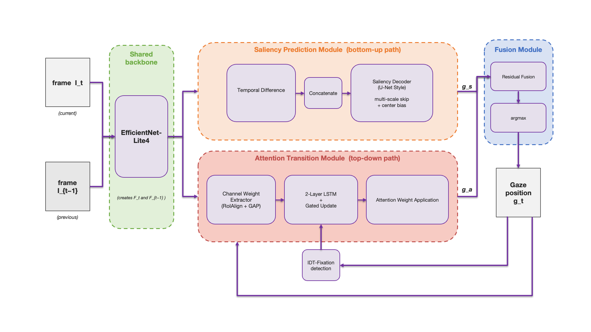

# EgoGazeLite: Lightweight Egocentric Gaze Prediction

### Look, No Eye-Tracker! Predicting Gaze for Video Cropping in Multimodal LLMs

#### Matteo Stoiber | [[Paper](https://arxiv.org/abs/2608.15614)]

---

**[Update]** Code and pretrained weights are available. See [Pretrained Weights](#pretrained-weights) below.

<p align="center">
  
  
  
  
</p>
<p align="center">
  
  
  
  
</p>

## Introduction

EgoGazeLite is a lightweight CNN-LSTM architecture for egocentric gaze prediction that eliminates the need for eye-tracking hardware. It preserves the dual-process structure of prior work (bottom-up saliency path and top-down attention transition path) while replacing heavier components with efficient alternatives:

- **EfficientNet-Lite4 backbone** instead of VGG16
- **Temporal frame differencing** instead of optical flow (no preprocessing required)
- **LSTM-gated attention transition** with velocity-based fixation detection
- **Residual gated fusion** combining both pathways



EgoGazeLite uses **15.7M parameters**, requires **6.71 GFLOPs per frame**, and runs at **30 FPS** on Apple Silicon MPS and **216 FPS** on iPhone 15 Pro Neural Engine. It is 3.2× smaller than Huang et al. (2018) and 4.5× smaller than Lai et al. (2023) in parameter count, while outperforming both on AUC. Lai et al. (2023) could not be converted to CoreML for mobile benchmarking (unsupported op).

## Installation

See [INSTALL.md](INSTALL.md).

## Data Preparation

EgoGazeLite trains on [Ego-Exo4D](https://ego-exo4d-data.org/). See [DATASET.md](data/DATASET.md) for download instructions.

The train/val/test splits are already included in `configs/egoexo4d_splits.json`, so you don't need to generate them yourself (see [GETTING_STARTED.md](GETTING_STARTED.md) if you want to regenerate them).

```bash
# Pre-build metadata cache (speeds up training startup)
python data/preprocessing_metadata_only.py \
    --data_root   /path/to/EgoExo4D \
    --splits_json configs/egoexo4d_splits.json \
    --cache_dir   /path/to/EgoExo4D/.cache
```

Then set `data_root` and `cache_dir` in the config you want to use.

## Training

Training proceeds in three stages: saliency decoder → attention transition → gated fusion. All stages are handled by a single script.

```bash
# Train all three stages from scratch
python train.py --config configs/full_run/full_run_option_b_cotrain.yaml

# Resume from a checkpoint at a specific stage
python train.py --config configs/full_run/full_run_option_b_cotrain.yaml \
    --resume experiments/full_run_egoexo_option_b_cotrain_v1/checkpoint_stage1_best.pt --stage 2
```

See [GETTING_STARTED.md](GETTING_STARTED.md) for a full step-by-step walkthrough including config options.

### Config options

| Config | Training data |
|--------|--------------|
| `configs/full_run/full_run_option_b_cotrain.yaml` | Option B (~68h, default) |
| `configs/full_run/full_run_option_a_cotrain.yaml` | Option A (~28h) |

## Evaluation

```bash
python evaluate.py \
    --checkpoint experiments/full_run_egoexo_option_b_cotrain_v1/checkpoint_final.pt \
    --data_root  /path/to/EgoExo4D \
    --cache_dir  /path/to/EgoExo4D/.cache \
    --option     b
```

Use `--option a` for Option A checkpoints and `--split generalization_test` for the held-out Basketball domain. Reported metrics: AUC, AAE (°), Pixel Distance, NSS, parameters, GFLOPs, FPS.

## Pretrained Weights

Evaluated on the Ego-Exo4D in-distribution validation set (AAE reported as AAE_argmax):

| Checkpoint | Dataset | AUC | AAE (°) | Pixel dist. | Download |
|-----------|---------|-----|---------|-------------|----------|
| EgoGazeLite-EgoExo4D-A | Ego-Exo4D Option A | 0.9655 | 8.33 | 26.35 | [download](https://huggingface.co/m4tteo3000/EgoGazeLite/resolve/main/egogazelite_option_a.pt) |
| EgoGazeLite-EgoExo4D-B | Ego-Exo4D Option B | 0.9644 | 8.25 | 26.44 | [download](https://huggingface.co/m4tteo3000/EgoGazeLite/resolve/main/egogazelite_option_b.pt) |

For cross-dataset comparison on GTEA Gaze+ (OP02, 30,344 frames):

| Checkpoint | Dataset | AUC | AAE_CoM (°) | Pixel dist. |
|-----------|---------|-----|------------|-------------|
| EgoGazeLite-GTEA | GTEA Gaze+ | 0.9592 | 5.97 | 29.17 |

## Citation

If you find this work useful, please cite:

```bibtex
@article{stoiber2026egogaze,
  title  = {Look, No Eye-Tracker! Predicting Gaze for Video Cropping in Multimodal LLMs},
  author = {Stoiber, Matteo},
  year   = {2026}
}
```

## Acknowledgements

This work builds on the dual-process gaze prediction framework of [Huang et al. (ECCV 2018)](https://arxiv.org/abs/1803.10794) and the egocentric gaze estimation approach of [Lai et al. (BMVC 2022 / IJCV 2023)](https://github.com/BolinLai/GLC). The Ego-Exo4D dataset is from [Grauman et al. (CVPR 2024)](https://ego-exo4d-data.org/). The demo GIFs above are made from Ego-Exo4D videos. If you use Ego-Exo4D, please also cite:

```bibtex
@inproceedings{grauman2024egoexo4d,
  title     = {Ego-Exo4D: Understanding Skilled Human Activity from First- and Third-Person Perspectives},
  author    = {Grauman, Kristen and others},
  booktitle = {Proceedings of the IEEE/CVF Conference on Computer Vision and Pattern Recognition (CVPR)},
  year      = {2024},
  url       = {https://arxiv.org/abs/2311.18259}
}
```
